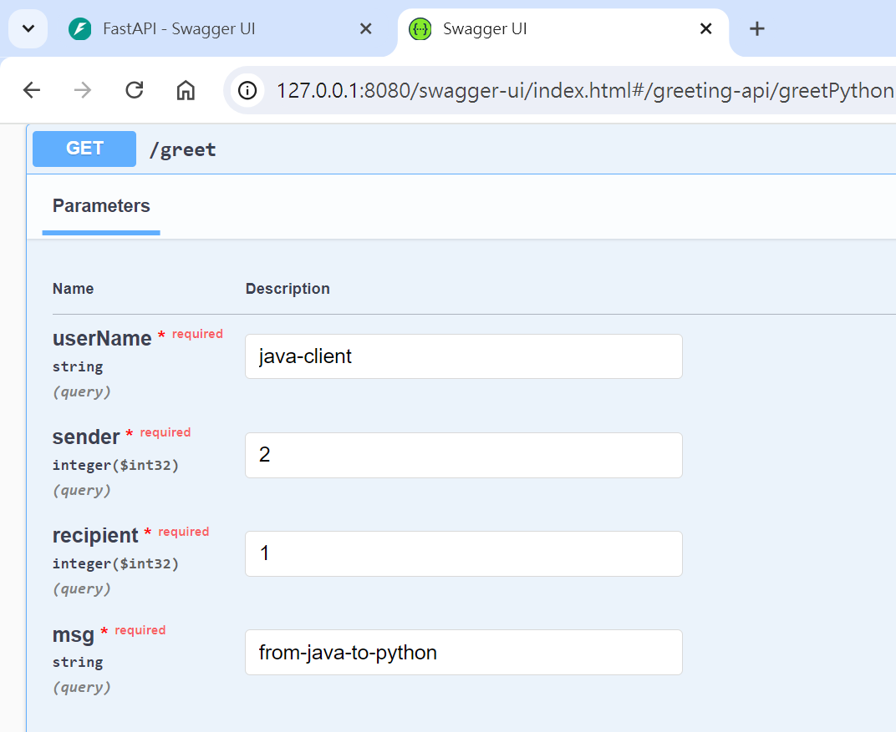
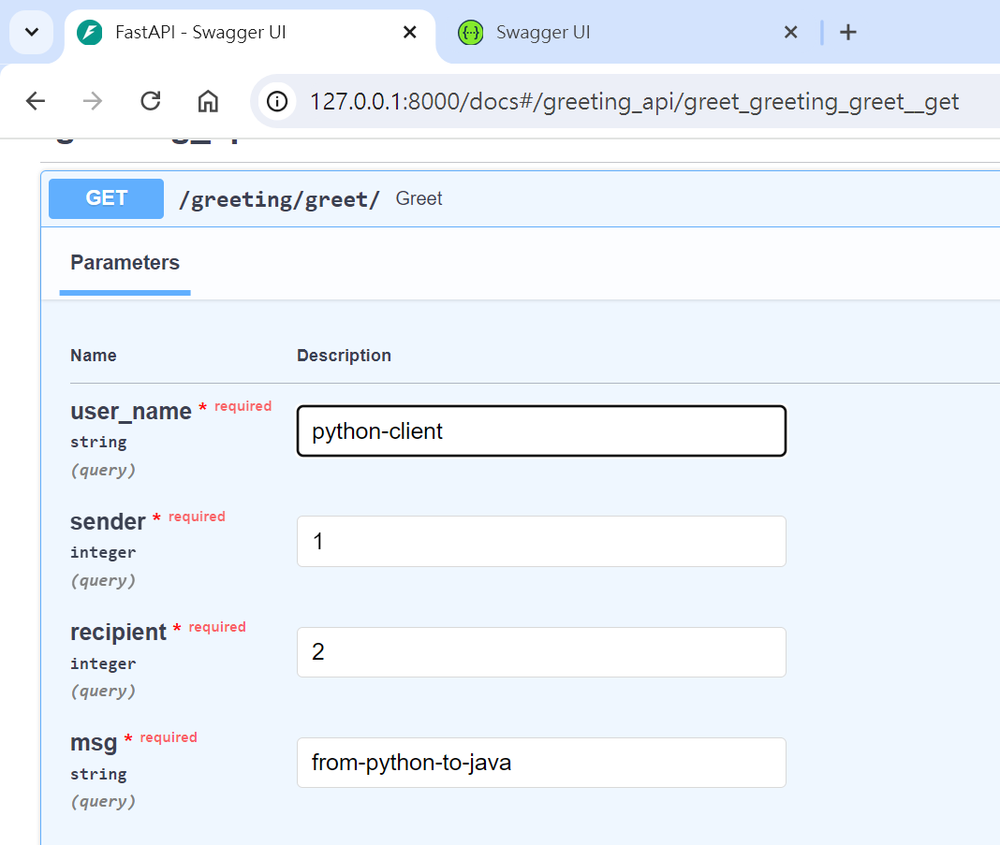

# grpc-demo
## Introduction
- This is a demo app to demonstrate the basic communication using gRPC.
- There are two servers in this app: Python-FastAPI with a gRPC server and Java-SpringBoot with a gRPC server.

## DDD Implementation
- I added a few DDD concepts to this app, but I only isolated layers where the functions are called from the inner layers.
    - The ports in Java are the interfaces that prevent my services from using infra code directly.
    - The adapters in Java are the implementation of the ports.
    - There are no ports in my Python code. I put my adapters in the services modules although this is not a standard architecture.

## gRPC Communication
```
Clients (Blocking Stub)  -->  Java-SpringBoot --> Java-gRPC --> Python-gRPC

Clients (Ansync Stub) -->  Python-FastAPI --> Python-gRPC --> Java-gRPC
```

## How to run the app
- Build the proto files.
```python
# java
# Use Maven and IDEA to build the proto files.

# Python
python -m grpc_tools.protoc \
--proto_path=. \
--python_out=. \
--pyi_out=. \
--grpc_python_out=. \
./python_grpc_v2/infra/grpc/protos/greeting/greeting.proto
```
- Start the servers
    - Java: `java-grpc-v2/infra/src/main/java/idv/sheng/java_grpc_v2/infra/JavaGrpcApplication.java`
    - Python: `python-grpc-v2/main.py`
- Use Swagger to test the APIs
    - Java: `http://127.0.0.1:8080/swagger-ui/index.html`
    - Python: `http://127.0.0.1:8000/docs`



